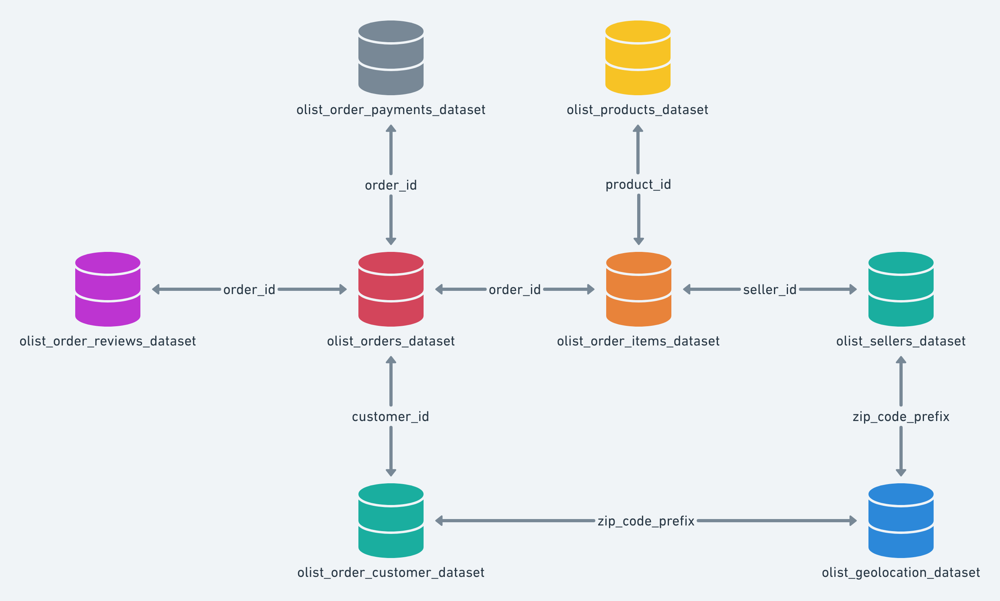

# MetricMind - Agentic BI Engine

## Project Description
This project aims to build an Agentic Semantic BI Engine that enables users to ask business questions in natural language and receive trusted, governed analytical insights.

## Team Members
Shreeya Balakrishna Naik
Sunayana A Channagiri
Navami NE
Pogakula Sai Akash
Srushti Angadi
P PAVITHRA

## Dataset

Olist Brazilian E-Commerce Dataset:
https://www.kaggle.com/datasets/olistbr/brazilian-ecommerce

## Technologies
- Python
- SQL

## Status
Project initialized.

## Project Workflow

1. Data Collection
2. Data Cleaning
3. Data Modeling
4. SQL Query Processing
5. Business Insights
6. Dashboard Development

Analyzed data, cleaned up, data modelling is been carried out, and working on requirements.

## Entity Relationship Diagram

The following ER diagram illustrates the relationships between the Olist Brazilian E-Commerce dataset tables.

Project updated on 20 July 2026.

## Project Progress - July 21, 2026

- Created Snowflake stage.
- Uploaded Olist dataset files.
- Continued Snowflake project setup.

## Progress Update

Completed:
- Snowflake environment setup
- Created OLIST_DB and RAW schema
- Created OLIST_STAGE
- Uploaded 9 Olist dataset CSV files
- Created CSV file format
- Loaded customers, orders, order_items, order_payments, order_review, products, sellers, geolocation, and product_category_translation tables into Snowflake

Next Steps:
- Install dbt
- Create staging models
- Build star schema

